# MagicTower (仿制的 魔塔v1.12) (Java 实现)

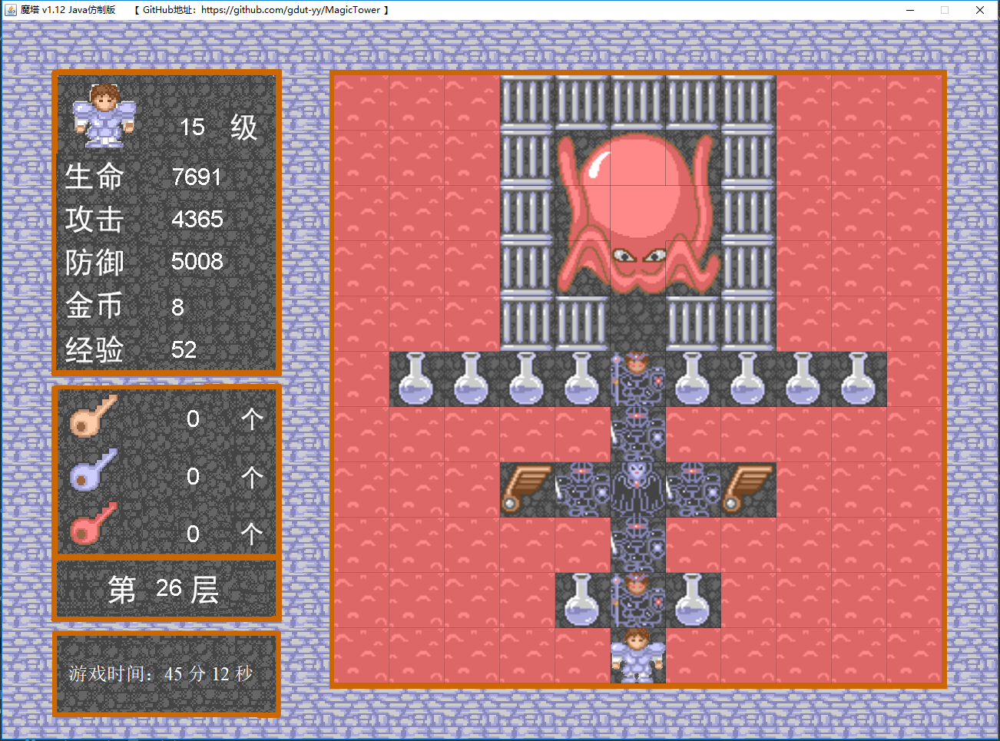

## 〇、历史版本

| 序号 | 版本号 | 说明 |
|---|--------|-----------|
| 1 | v1.0.0 | 借用网上的资源文件；实现了前 21 层；完成了若干简单功能。|
| 2 | v1.0.1 | Photoshop 重做全部资源文件；重构数据获取方式；实现全部 26 层；重构设计模式（精简代码前的中间版本）。 |
| 3 | v1.0.2 | 调试版本，对话模块待完善，剧情模块待完善。 |

## 一、关于作者

本人最早于 2006 年左右接触到魔塔游戏（魔塔 v1.12）。当时是刚学会上网不久后，发现了并热衷于 4399网站上的小游戏。
一天晚上，因为无聊，无意中打开了 4399小游戏 里的 **[魔塔小游戏](http://www.4399.com/flash/1749_1.htm)**。
一瞬间感觉回到了童年。还清晰记得当年卡在了第 16 层的 “boss”，当晚决心要以自己的智慧通关。因尝试了多次也无法突破一些楼层，
于是只好求助攻略，不知不觉玩到了凌晨，终于通关。发现了居然还有隐藏关卡。

本着对魔塔游戏的热爱，考虑到魔塔已经是十多年前的 flash 小游戏了（flash 已是过时技术），又因为是 CS专业 的学生，
于是便琢磨能不能把游戏重写一遍。

于是，便有了这个项目。。。

**注：**

- **项目下的 [ 魔塔V1.12.swf ] 为游戏原作品**
- **项目下的 [ 开始游戏.jar ] 为本人的仿制作品（ 目前仅支持分辨率 1920 * 1080 以上的显示器 ）**

## 二、操作指南（本游戏适合 18 岁以上用户）

点击 根目录下的 **“开始游戏.jar”** 开始游戏

- 方向键：人物移动；
- 空格键：确认；
- W S 键：商店、老人、商人、楼层跳跃事件的 光标上下移动； 
- J 键：获得道具【风之罗盘】后，打开 楼层跳跃 面板；
- L 键：获得道具【圣光徽】后，打开 预测功能 面板。

## 三、当前版本已知的 Bug（后续版本会修复）

- 白衣武士，不论攻防，会扣除当前 1/4 生命
- 灵法师，不论攻防，会扣除当前 1/3 生命
- 部分对话事件和剧情未实现
- 楼层跳跃时可以跳跃到未到达过的楼层 
- ······

## 四、开发环境

	IntelliJ IDEA 2017.3.2 (Ultimate Edition)
	Build #IU-173.4127.27, built on December 26, 2017
	Licensed to Z YY
	Subscription is active until May 31, 2019
	For educational use only.
	JRE: 1.8.0_152-release-1024-b8 amd64
	JVM: OpenJDK 64-Bit Server VM by JetBrains s.r.o
	Windows 10 10.0

----

## 五、设计模式

- 关于 static 关键字使用。游戏中全局数据使用 static 修饰。数据预设部分为方便也使用 static。
- package 划分：bean 为实体类；util 为具体功能类；data 为数据源。
- 地图数据：MapData（26层的初始地形，对应资源文件）
- 怪物数据：MonsterData（33种怪物，id、名字、生命、攻击、防御、金钱、经验）
- 图片数据：ImageData（统一获取资源文件，转为 static）
- 对话数据：DialogData（全部对话数据）
- 地图动画：通过 Timer 交替引用资源文件实现

----

## 附：开发文档

### 1. 资源文件

考虑到需要仿制的这个魔塔游戏，那么游戏的资源文件是必不可少的，只有拿到资源文件，才有可能还原这个游戏。我的想法主要有两种：一是通过玩一遍游戏，截屏游戏的截图，再通过Photoshop切图提取；第二种是直接使用工具打开游戏的 .swf 文件，查看资源文件，由于本人所使用的“硕思闪客精灵”需要购买会员才能导出资源，便只好通过截屏的方式在Photoshop中切图提取。

为证明我两种方法都有去尝试了，下面分享一下所截的图：

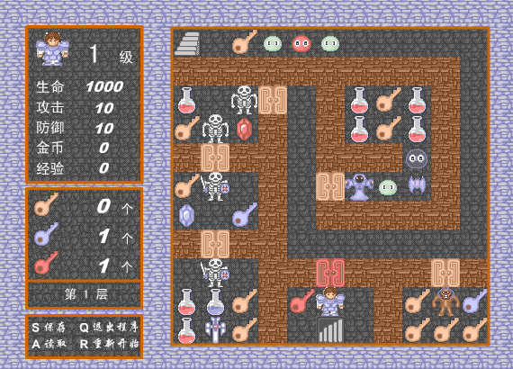

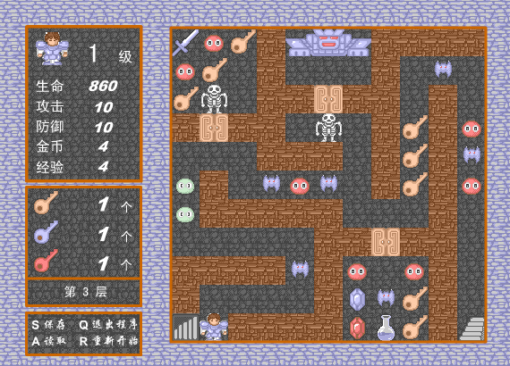
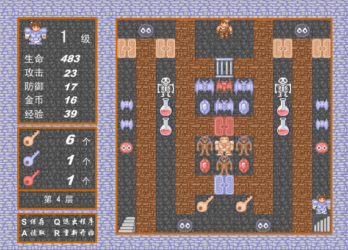

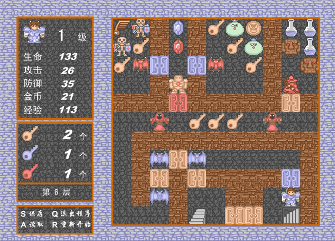
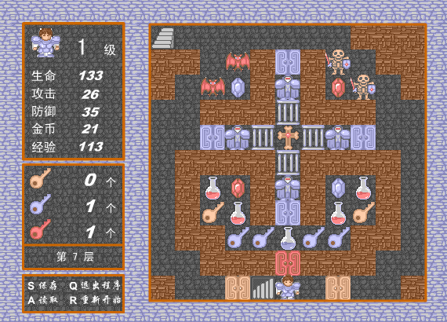
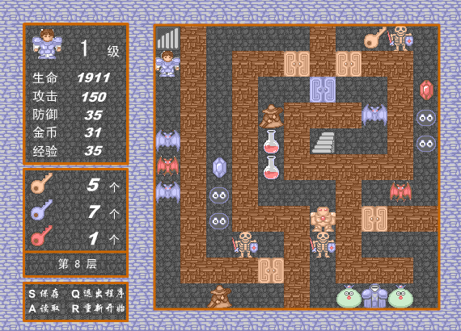
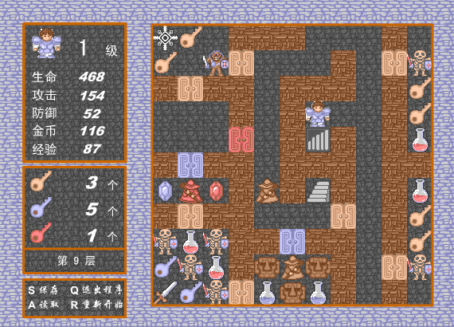

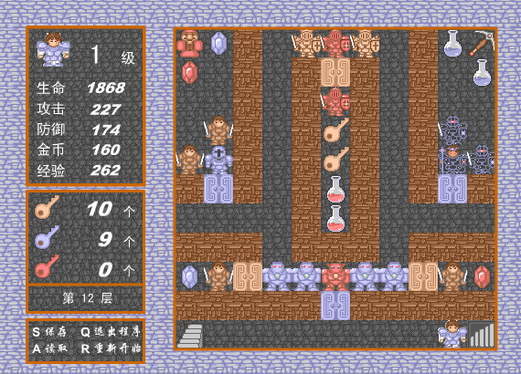
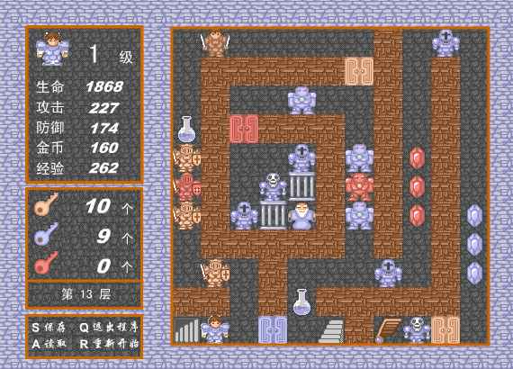
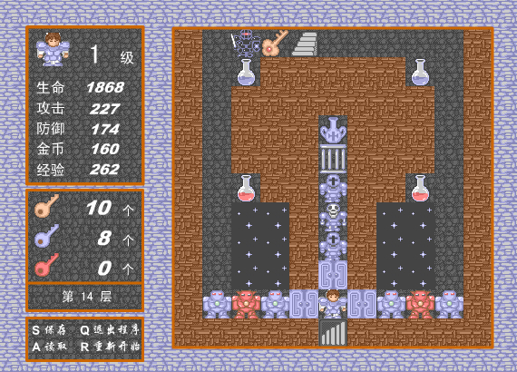
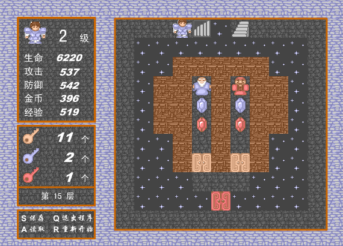
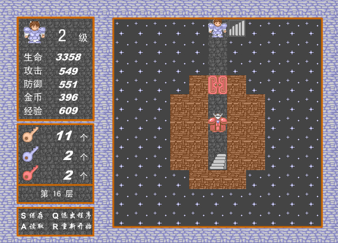
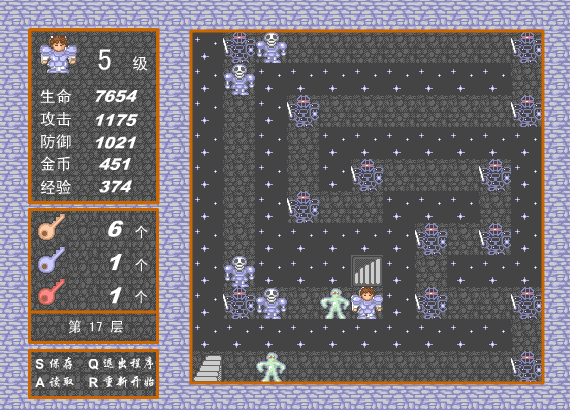
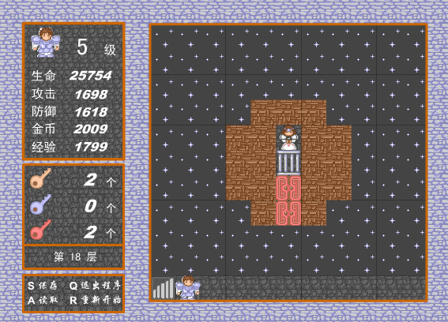

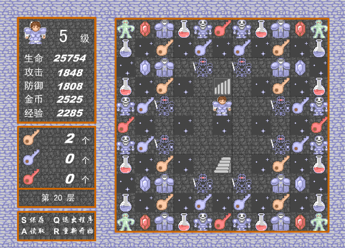

第一种方法有较大的工作量，通常需要玩几遍游戏。而且游戏里面的渲染不是规则的正方形，即便是切图也有不少的工作量。

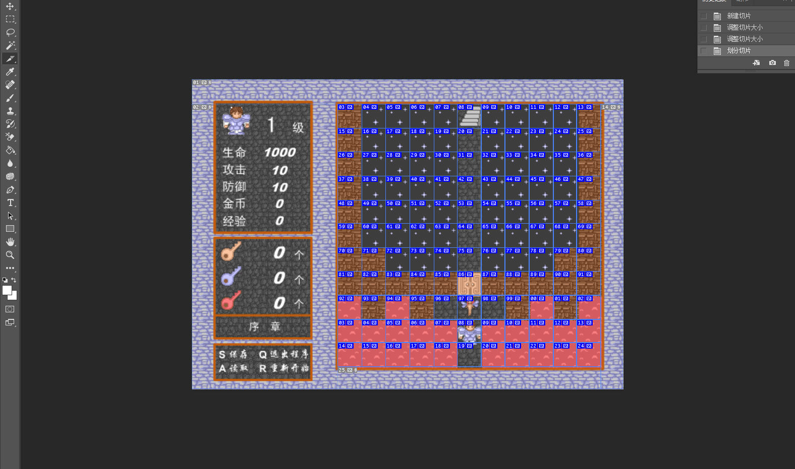

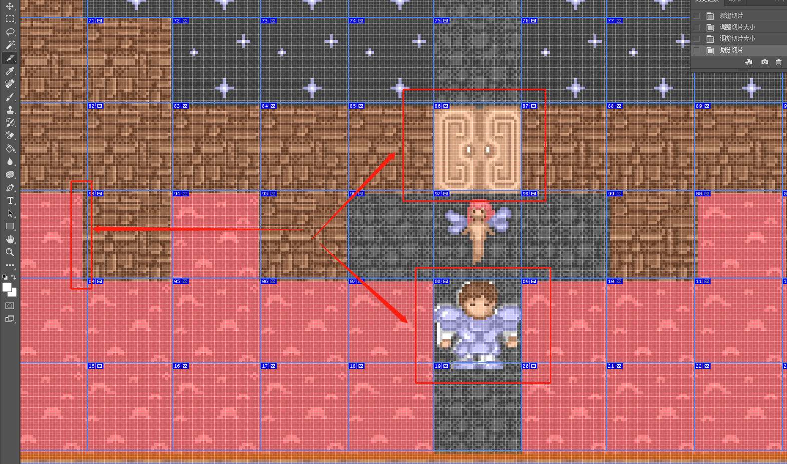

----

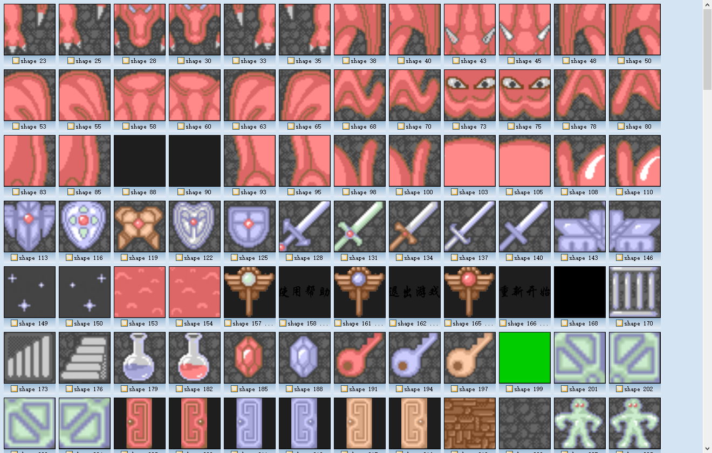
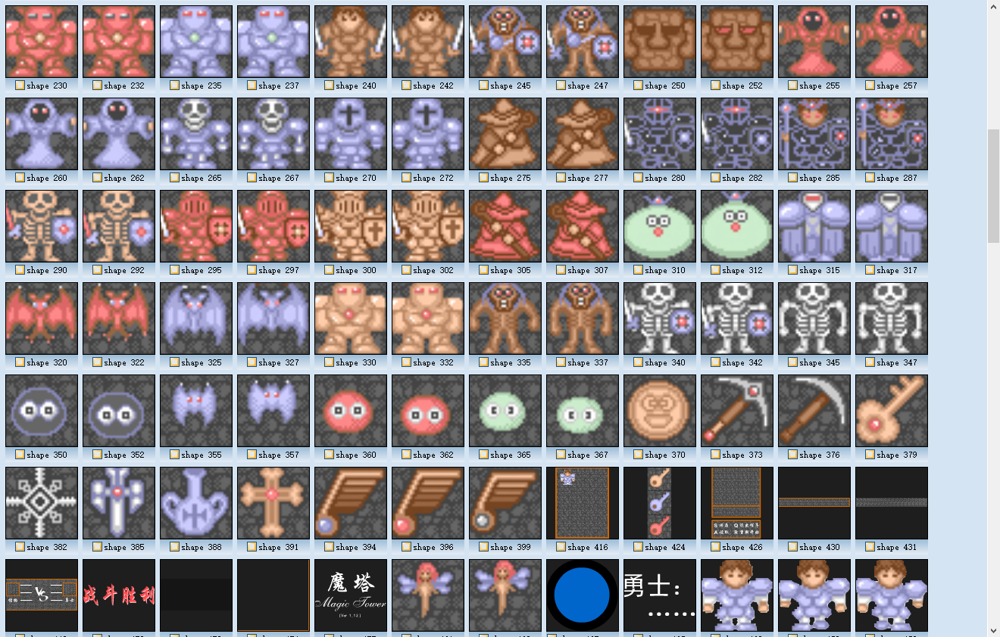
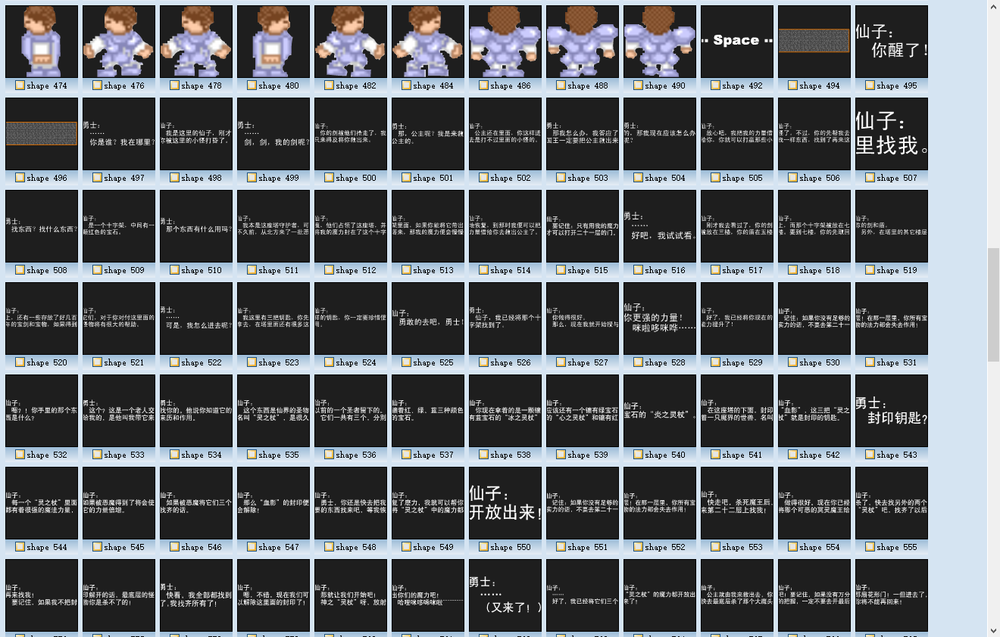
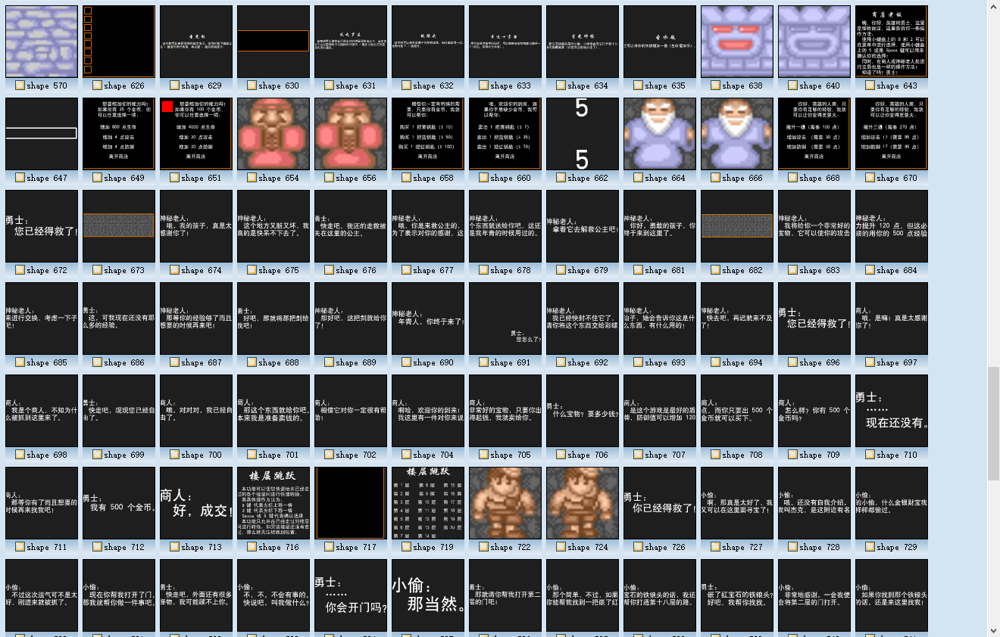
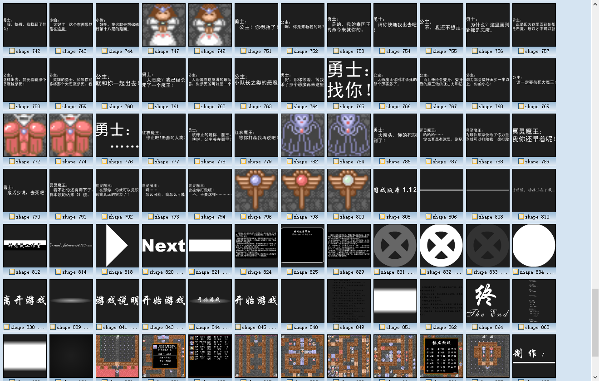

第二种方法的截图是 1920 * 1080 屏幕下，“硕思闪客精灵”的截图，相比而言，在这 5 张截图上进行切图，工作量减少了一大半。

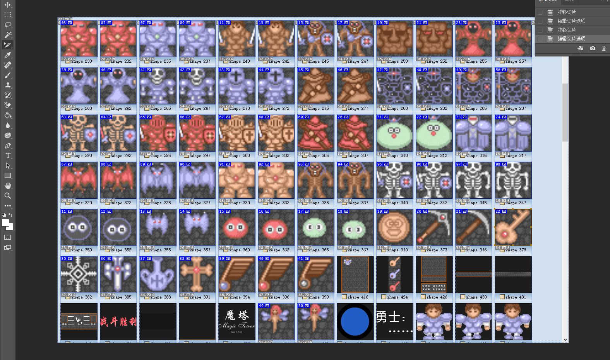

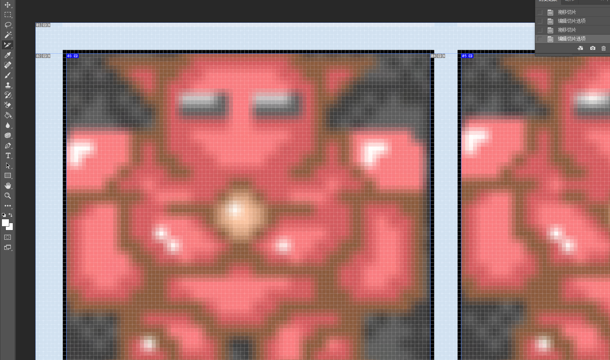

----

最终处理好的资源文件如下：

| 资源名 | frame 0 | frame 1 |
| - | - | - |
| 0.png |  |  |
| 1.png |  |  |
| 2.png |  |  |
| 3.png |  |  |
| 4.png |  |  |
| 5.png |  |  |
| 6.png |  |  |
| 7.png |  |  |
| 8.png |  |  |
| 9.png |  |  |
| 10.png |  |  |
| 11.png |  |  |
| 12.png |  |  |
| 13.png |  |  |
| 14.png |  |  |
| 15.png |  |  |
| 19.png |  |  |
| 20.png |  |  |
| 21.png |  |  |
| 22.png |  |  |
| 23.png |  |  |
| 24.png |  |  |
| 25.png |  |  |
| 26.png |  |  |
| 27.png |  |  |
| 28.png |  |  |
| 30.png |  |  |
| 31.png |  |  |
| 32.png |  |  |
| 33.png |  |  |
| 34.png |  |  |
| 35.png |  |  |
| 36.png |  |  |
| 38.png |  |  |
| 39.png |  |  |
| 40.png |  |  |
| 41.png |  |  |
| 42.png |  |  |
| 43.png |  |  |
| 44.png |  |  |
| 45.png |  |  |
| 46.png |  |  |
| 47.png |  |  |
| 48.png |  |  |
| 49.png |  |  |
| 50.png |  |  |
| 51.png |  |  |
| 52.png |  |  |
| 53.png |  |  |
| 54.png |  |  |
| 55.png |  |  |
| 56.png |  |  |
| 57.png |  |  |
| 58.png |  |  |
| 59.png |  |  |
| 60.png |  |  |
| 61.png |  |  |
| 62.png |  |  |
| 63.png |  |  |
| 64.png |  |  |
| 65.png |  |  |
| 66.png |  |  |
| 67.png |  |  |
| 68.png |  |  |
| 69.png |  |  |
| 70.png |  |  |
| 71.png |  |  |
| 73.png |  |  |
| 75.png |  |  |
| 76.png |  |  |
| 78.png |  |  |
| 80.png |  |  |
| 202.png |  |  |
| 203.png |  |  |

| boss 1（魔龙） | frame 0 | frame 0 | frame 0 | frame 1 | frame 1 | frame 1 |
|-|-|-|-|-|-|-|
| 181.png + 182.png + 183.png |  |  |  |  |  |  |
| 184.png + 185.png + 186.png |  |  |  |  |  |  |
| 187.png + 188.png + 189.png |  |  |  |  |  |  |

| boss 2（血影） | frame 0 | frame 0 | frame 0 | frame 1 | frame 1 | frame 1 |
|-|-|-|-|-|-|-|
| 191.png + 192.png + 193.png |  |  |  |  |  |  |
| 194.png + 195.png + 196.png |  |  |  |  |  |  |
| 197.png + 198.png + 199.png |  |  |  |  |  |  |

游戏主背景图：

战斗背景图：

### 2. 游戏数据

数据是一个游戏的灵魂，直接决定了游戏的可玩性。源文件分析出来的数据如下：

#### 2.1 怪物数据

	boss_man[0] = new Array(50, 20, 1, 1, 1, "绿头怪");
	boss_man[1] = new Array(70, 15, 2, 2, 2, "红头怪");
	boss_man[2] = new Array(100, 20, 5, 3, 3, "小蝙蝠");
	boss_man[4] = new Array(110, 25, 5, 5, 4, "骷髅人");
	boss_man[3] = new Array(200, 35, 10, 5, 5, "青头怪");
	boss_man[5] = new Array(150, 40, 20, 8, 6, "骷髅士兵");
	boss_man[23] = new Array(125, 50, 25, 10, 7, "初级法师");
	boss_man[8] = new Array(150, 65, 30, 10, 8, "大蝙蝠");
	boss_man[6] = new Array(300, 75, 45, 13, 10, "兽面人");
	boss_man[16] = new Array(400, 90, 50, 15, 12, "骷髅队长");
	boss_man[25] = new Array(500, 115, 65, 15, 15, "石头怪人");
	boss_man[20] = new Array(250, 120, 70, 20, 17, "麻衣法师");
	boss_man[7] = new Array(450, 150, 90, 22, 19, "初级卫兵");
	boss_man[9] = new Array(550, 160, 90, 25, 20, "红蝙蝠");
	boss_man[24] = new Array(100, 200, 110, 30, 25, "高级法师");
	boss_man[11] = new Array(700, 250, 125, 32, 30, "怪王");
	boss_man[10] = new Array(1300, 300, 150, 40, 35, "白衣武士");
	boss_man[14] = new Array(850, 350, 200, 45, 40, "金甲卫士");
	boss_man[12] = new Array(500, 400, 260, 47, 45, "红衣法师");
	boss_man[26] = new Array(900, 450, 330, 50, 50, "兽面武士");
	boss_man[28] = new Array(1250, 500, 400, 55, 55, "冥卫兵");
	boss_man[29] = new Array(1500, 560, 460, 60, 60, "高级卫兵");
	boss_man[27] = new Array(1200, 620, 520, 65, 75, "双手剑士");
	boss_man[21] = new Array(2000, 680, 590, 70, 65, "冥战士");
	boss_man[15] = new Array(900, 750, 650, 77, 70, "金甲队长");
	boss_man[17] = new Array(1500, 830, 730, 80, 70, "灵法师");
	boss_man[22] = new Array(2500, 900, 850, 84, 75, "冥队长");
	boss_man[18] = new Array(1200, 980, 900, 88, 75, "灵武士");
	boss_man[30] = new Array(3100, 1150, 1050, 92, 80, "影子战士");
	boss_man[13] = new Array(15000, 1000, 1000, 100, 100, "红衣魔王");
	boss_man[19] = new Array(30000, 1700, 1500, 250, 220, "冥灵魔王");
	boss_man[31] = new Array(99999, 5000, 4000, 0, 0, "血影");
	boss_man[32] = new Array(99999, 9999, 5000, 0, 0, "魔龙");

#### 2.2 地图数据：

	// [Action in Frame 4346]
	mt_line_00 = new Array(11);
	mt_line_00[0] = new Array(1, 20, 20, 20, 20, 13, 20, 20, 20, 20, 1);
	mt_line_00[1] = new Array(1, 20, 20, 20, 20, 98, 20, 20, 20, 20, 1);
	mt_line_00[2] = new Array(1, 20, 20, 20, 20, 0, 20, 20, 20, 20, 1);
	mt_line_00[3] = new Array(1, 20, 20, 20, 20, 0, 20, 20, 20, 20, 1);
	mt_line_00[4] = new Array(1, 20, 20, 20, 20, 0, 20, 20, 20, 20, 1);
	mt_line_00[5] = new Array(1, 20, 20, 20, 20, 0, 20, 20, 20, 20, 1);
	mt_line_00[6] = new Array(1, 1, 20, 20, 20, 0, 20, 20, 20, 1, 1);
	mt_line_00[7] = new Array(1, 1, 1, 1, 1, 2, 1, 1, 1, 1, 1);
	mt_line_00[8] = new Array(19, 1, 19, 1, 0, 24, 0, 1, 19, 1, 19);
	mt_line_00[9] = new Array(19, 19, 19, 19, 19, 99, 19, 19, 19, 19, 19);
	mt_line_00[10] = new Array(19, 19, 19, 19, 19, 0, 19, 19, 19, 19, 19);
	mt_line_01 = new Array(11);
	mt_line_01[0] = new Array(13, 98, 6, 40, 41, 40, 0, 0, 0, 0, 0);
	mt_line_01[1] = new Array(1, 1, 1, 1, 1, 1, 1, 1, 1, 1, 0);
	mt_line_01[2] = new Array(11, 0, 44, 2, 0, 1, 11, 6, 11, 1, 0);
	mt_line_01[3] = new Array(6, 44, 10, 1, 0, 1, 11, 6, 11, 1, 0);
	mt_line_01[4] = new Array(1, 2, 1, 1, 0, 1, 1, 1, 43, 1, 0);
	mt_line_01[5] = new Array(6, 45, 0, 1, 0, 2, 63, 40, 42, 1, 0);
	mt_line_01[6] = new Array(9, 0, 7, 1, 0, 1, 1, 1, 1, 1, 0);
	mt_line_01[7] = new Array(1, 2, 1, 1, 0, 0, 0, 0, 0, 0, 0);
	mt_line_01[8] = new Array(0, 45, 0, 1, 1, 4, 1, 1, 1, 2, 1);
	mt_line_01[9] = new Array(11, 12, 6, 1, 8, 97, 0, 1, 6, 46, 7);
	mt_line_01[10] = new Array(11, 34, 6, 1, 0, 14, 0, 1, 6, 6, 6);
	mt_line_02 = new Array(11);
	mt_line_02[0] = new Array(14, 1, 0, 55, 0, 1, 10, 9, 6, 8, 1);
	mt_line_02[1] = new Array(97, 1, 9, 1, 12, 1, 10, 9, 6, 7, 1);
	mt_line_02[2] = new Array(0, 1, 6, 1, 6, 1, 10, 9, 6, 54, 1);
	mt_line_02[3] = new Array(0, 1, 6, 1, 6, 1, 1, 1, 1, 2, 1);
	mt_line_02[4] = new Array(0, 1, 0, 1, 0, 0, 0, 2, 0, 0, 1);
	mt_line_02[5] = new Array(0, 1, 2, 1, 1, 2, 1, 1, 2, 1, 1);
	mt_line_02[6] = new Array(0, 5, 0, 0, 0, 0, 1, 0, 54, 0, 1);
	mt_line_02[7] = new Array(0, 1, 2, 1, 1, 3, 1, 115, 1, 115, 1);
	mt_line_02[8] = new Array(0, 1, 6, 1, 12, 11, 1, 0, 1, 0, 1);
	mt_line_02[9] = new Array(98, 1, 6, 1, 12, 11, 1, 0, 1, 0, 1);
	mt_line_02[10] = new Array(13, 1, 10, 1, 12, 11, 1, 26, 1, 27, 1);
	mt_line_03 = new Array(11);
	mt_line_03[0] = new Array(71, 41, 6, 1, 23, 22, 21, 1, 1, 1, 1);
	mt_line_03[1] = new Array(41, 6, 0, 1, 0, 0, 0, 1, 0, 42, 0);
	mt_line_03[2] = new Array(6, 44, 0, 1, 1, 2, 1, 1, 0, 1, 0);
	mt_line_03[3] = new Array(1, 2, 1, 1, 0, 44, 0, 1, 6, 1, 41);
	mt_line_03[4] = new Array(0, 0, 0, 1, 1, 1, 0, 1, 6, 1, 42);
	mt_line_03[5] = new Array(40, 1, 0, 42, 41, 42, 0, 1, 6, 1, 41);
	mt_line_03[6] = new Array(40, 1, 1, 1, 1, 1, 0, 0, 0, 1, 0);
	mt_line_03[7] = new Array(0, 0, 0, 0, 0, 1, 1, 2, 1, 1, 0);
	mt_line_03[8] = new Array(1, 1, 1, 1, 42, 1, 41, 0, 41, 1, 0);
	mt_line_03[9] = new Array(1, 0, 0, 0, 0, 1, 9, 42, 6, 1, 98);
	mt_line_03[10] = new Array(14, 97, 1, 1, 1, 1, 10, 12, 6, 1, 13);
	mt_line_04 = new Array(11);
	mt_line_04[0] = new Array(0, 43, 0, 1, 0, 25, 0, 1, 0, 43, 0);
	mt_line_04[1] = new Array(2, 1, 2, 1, 0, 0, 0, 1, 2, 1, 2);
	mt_line_04[2] = new Array(0, 1, 0, 1, 1, 115, 1, 1, 0, 1, 0);
	mt_line_04[3] = new Array(0, 1, 44, 1, 48, 49, 48, 1, 44, 1, 0);
	mt_line_04[4] = new Array(42, 1, 11, 1, 9, 48, 9, 1, 11, 1, 42);
	mt_line_04[5] = new Array(42, 1, 11, 1, 1, 4, 1, 1, 11, 1, 42);
	mt_line_04[6] = new Array(41, 1, 0, 1, 46, 47, 46, 1, 0, 1, 41);
	mt_line_04[7] = new Array(0, 1, 0, 1, 10, 46, 10, 1, 0, 1, 0);
	mt_line_04[8] = new Array(0, 1, 0, 1, 1, 3, 1, 1, 0, 1, 0);
	mt_line_04[9] = new Array(98, 1, 0, 1, 6, 0, 6, 1, 0, 1, 97);
	mt_line_04[10] = new Array(13, 1, 0, 43, 0, 0, 0, 43, 0, 1, 14);
	mt_line_05 = new Array(11);
	mt_line_05[0] = new Array(36, 1, 11, 1, 12, 63, 0, 0, 63, 6, 7);
	mt_line_05[1] = new Array(0, 1, 10, 1, 63, 0, 0, 0, 0, 63, 6);
	mt_line_05[2] = new Array(48, 1, 0, 1, 45, 0, 1, 1, 2, 1, 1);
	mt_line_05[3] = new Array(0, 2, 63, 1, 76, 45, 1, 0, 46, 45, 27);
	mt_line_05[4] = new Array(48, 1, 0, 1, 1, 1, 1, 0, 0, 0, 45);
	mt_line_05[5] = new Array(10, 1, 0, 0, 0, 42, 44, 0, 0, 0, 0);
	mt_line_05[6] = new Array(9, 1, 1, 43, 1, 1, 1, 1, 0, 0, 0);
	mt_line_05[7] = new Array(0, 26, 1, 43, 1, 0, 0, 0, 46, 47, 0);
	mt_line_05[8] = new Array(1, 1, 1, 42, 1, 2, 1, 3, 1, 2, 1);
	mt_line_05[9] = new Array(97, 0, 1, 0, 1, 42, 1, 9, 2, 98, 1);
	mt_line_05[10] = new Array(14, 0, 42, 0, 0, 0, 1, 6, 1, 13, 1);
	mt_line_06 = new Array(11);
	mt_line_06[0] = new Array(30, 56, 1, 9, 1, 6, 51, 39, 1, 12, 12);
	mt_line_06[1] = new Array(56, 6, 1, 10, 1, 0, 6, 51, 1, 65, 12);
	mt_line_06[2] = new Array(6, 49, 3, 0, 3, 49, 0, 6, 1, 0, 65);
	mt_line_06[3] = new Array(0, 0, 1, 47, 1, 0, 0, 0, 1, 52, 0);
	mt_line_06[4] = new Array(1, 1, 1, 4, 1, 1, 1, 1, 1, 2, 1);
	mt_line_06[5] = new Array(0, 0, 64, 0, 6, 6, 6, 0, 64, 0, 0);
	mt_line_06[6] = new Array(0, 1, 1, 1, 1, 1, 1, 1, 1, 1, 1);
	mt_line_06[7] = new Array(0, 1, 48, 2, 48, 0, 0, 0, 0, 0, 1);
	mt_line_06[8] = new Array(0, 1, 2, 1, 2, 1, 1, 1, 1, 3, 1);
	mt_line_06[9] = new Array(0, 1, 48, 1, 0, 0, 1, 1, 0, 97, 1);
	mt_line_06[10] = new Array(0, 0, 0, 1, 13, 98, 2, 2, 0, 14, 1);
	mt_line_07 = new Array(11);
	mt_line_07[0] = new Array(13, 98, 0, 0, 0, 0, 0, 0, 1, 1, 1);
	mt_line_07[1] = new Array(1, 1, 0, 49, 1, 3, 1, 56, 0, 1, 1);
	mt_line_07[2] = new Array(1, 0, 49, 9, 1, 50, 1, 10, 56, 0, 1);
	mt_line_07[3] = new Array(0, 0, 1, 1, 1, 15, 1, 1, 1, 0, 0);
	mt_line_07[4] = new Array(0, 0, 3, 50, 115, 32, 15, 50, 3, 0, 0);
	mt_line_07[5] = new Array(0, 1, 1, 1, 1, 15, 1, 1, 1, 1, 0);
	mt_line_07[6] = new Array(0, 1, 11, 10, 1, 50, 1, 9, 11, 1, 0);
	mt_line_07[7] = new Array(0, 1, 6, 11, 1, 3, 1, 11, 6, 1, 0);
	mt_line_07[8] = new Array(0, 1, 1, 7, 7, 12, 7, 7, 1, 1, 0);
	mt_line_07[9] = new Array(0, 0, 1, 1, 1, 4, 1, 1, 1, 0, 0);
	mt_line_07[10] = new Array(1, 0, 0, 2, 14, 97, 0, 2, 0, 0, 1);
	mt_line_08 = new Array(11);
	mt_line_08[0] = new Array(14, 1, 0, 0, 0, 0, 1, 0, 6, 56, 0);
	mt_line_08[1] = new Array(97, 1, 0, 1, 1, 2, 1, 2, 1, 1, 0);
	mt_line_08[2] = new Array(0, 1, 0, 1, 0, 0, 3, 0, 0, 1, 10);
	mt_line_08[3] = new Array(0, 1, 0, 1, 60, 1, 1, 1, 48, 1, 43);
	mt_line_08[4] = new Array(48, 1, 0, 1, 11, 1, 13, 98, 0, 1, 43);
	mt_line_08[5] = new Array(49, 1, 9, 1, 11, 1, 1, 1, 1, 1, 0);
	mt_line_08[6] = new Array(48, 1, 43, 1, 0, 0, 0, 1, 0, 49, 0);
	mt_line_08[7] = new Array(0, 1, 43, 1, 1, 1, 47, 1, 2, 1, 1);
	mt_line_08[8] = new Array(0, 1, 0, 56, 0, 1, 56, 1, 0, 0, 0);
	mt_line_08[9] = new Array(0, 1, 1, 1, 2, 1, 0, 1, 1, 1, 0);
	mt_line_08[10] = new Array(0, 0, 60, 0, 0, 1, 0, 51, 50, 51, 0);
	mt_line_09 = new Array(11);
	mt_line_09[0] = new Array(35, 6, 0, 1, 1, 1, 0, 0, 0, 1, 0);
	mt_line_09[1] = new Array(6, 0, 66, 2, 0, 0, 0, 1, 0, 2, 56);
	mt_line_09[2] = new Array(1, 2, 1, 1, 0, 1, 1, 1, 0, 1, 6);
	mt_line_09[3] = new Array(0, 0, 0, 1, 0, 1, 97, 0, 0, 1, 6);
	mt_line_09[4] = new Array(0, 0, 0, 4, 0, 1, 14, 1, 0, 1, 11);
	mt_line_09[5] = new Array(1, 3, 1, 1, 0, 1, 1, 1, 0, 1, 1);
	mt_line_09[6] = new Array(9, 52, 10, 1, 60, 1, 13, 1, 0, 1, 11);
	mt_line_09[7] = new Array(1, 2, 1, 1, 0, 0, 98, 2, 0, 1, 6);
	mt_line_09[8] = new Array(56, 11, 56, 1, 1, 3, 1, 1, 0, 1, 6);
	mt_line_09[9] = new Array(7, 56, 11, 1, 65, 60, 65, 1, 0, 2, 56);
	mt_line_09[10] = new Array(73, 7, 56, 2, 12, 65, 12, 1, 0, 1, 0);
	mt_line_10 = new Array(11);
	mt_line_10[0] = new Array(0, 1, 1, 9, 66, 1, 66, 10, 1, 1, 0);
	mt_line_10[1] = new Array(0, 0, 1, 1, 2, 1, 2, 1, 1, 0, 52);
	mt_line_10[2] = new Array(0, 0, 0, 0, 0, 1, 0, 0, 0, 52, 12);
	mt_line_10[3] = new Array(0, 1, 0, 1, 1, 1, 1, 1, 0, 1, 1);
	mt_line_10[4] = new Array(48, 1, 0, 0, 6, 6, 6, 0, 0, 1, 6);
	mt_line_10[5] = new Array(49, 1, 0, 1, 1, 1, 1, 2, 1, 1, 6);
	mt_line_10[6] = new Array(48, 1, 0, 115, 97, 14, 1, 0, 2, 49, 0);
	mt_line_10[7] = new Array(0, 1, 1, 1, 1, 1, 1, 2, 1, 1, 0);
	mt_line_10[8] = new Array(0, 1, 11, 9, 10, 1, 0, 49, 0, 1, 6);
	mt_line_10[9] = new Array(98, 1, 11, 9, 10, 4, 60, 1, 60, 1, 6);
	mt_line_10[10] = new Array(13, 1, 11, 9, 10, 1, 7, 1, 7, 1, 11);
	mt_line_11 = new Array(11);
	mt_line_11[0] = new Array(11, 1, 6, 1, 7, 1, 8, 1, 12, 78, 12);
	mt_line_11[1] = new Array(11, 1, 6, 1, 7, 1, 8, 1, 68, 69, 68);
	mt_line_11[2] = new Array(11, 1, 6, 1, 7, 1, 8, 1, 0, 68, 0);
	mt_line_11[3] = new Array(2, 1, 2, 1, 2, 1, 2, 1, 1, 3, 1);
	mt_line_11[4] = new Array(0, 0, 0, 0, 0, 1, 0, 0, 0, 0, 0);
	mt_line_11[5] = new Array(2, 1, 1, 3, 1, 1, 1, 3, 1, 1, 2);
	mt_line_11[6] = new Array(9, 1, 0, 68, 12, 67, 12, 68, 0, 1, 10);
	mt_line_11[7] = new Array(9, 1, 66, 1, 1, 1, 1, 1, 66, 1, 10);
	mt_line_11[8] = new Array(9, 1, 66, 1, 23, 22, 21, 1, 66, 1, 10);
	mt_line_11[9] = new Array(1, 1, 4, 1, 11, 0, 11, 1, 4, 1, 1);
	mt_line_11[10] = new Array(14, 97, 0, 0, 0, 0, 0, 0, 0, 98, 13);
	mt_line_12 = new Array(11);
	mt_line_12[0] = new Array(27, 9, 1, 0, 54, 55, 54, 0, 1, 12, 38);
	mt_line_12[1] = new Array(10, 0, 1, 0, 1, 2, 1, 0, 1, 0, 12);
	mt_line_12[2] = new Array(0, 0, 1, 0, 1, 55, 1, 0, 1, 0, 0);
	mt_line_12[3] = new Array(0, 67, 1, 0, 1, 6, 1, 0, 1, 58, 0);
	mt_line_12[4] = new Array(67, 61, 1, 0, 1, 6, 1, 0, 1, 57, 58);
	mt_line_12[5] = new Array(1, 3, 1, 0, 1, 11, 1, 0, 1, 3, 1);
	mt_line_12[6] = new Array(0, 0, 0, 0, 1, 11, 1, 0, 0, 0, 0);
	mt_line_12[7] = new Array(1, 1, 1, 0, 1, 1, 1, 0, 1, 1, 1);
	mt_line_12[8] = new Array(9, 67, 2, 68, 68, 69, 68, 68, 2, 67, 10);
	mt_line_12[9] = new Array(1, 1, 1, 1, 1, 3, 1, 1, 1, 1, 1);
	mt_line_12[10] = new Array(13, 98, 0, 0, 0, 0, 0, 0, 0, 97, 14);
	mt_line_13 = new Array(11);
	mt_line_13[0] = new Array(0, 67, 0, 0, 0, 0, 0, 1, 0, 61, 0);
	mt_line_13[1] = new Array(0, 1, 1, 1, 1, 1, 2, 1, 0, 1, 0);
	mt_line_13[2] = new Array(0, 1, 0, 0, 68, 0, 0, 1, 0, 1, 0);
	mt_line_13[3] = new Array(12, 1, 4, 1, 1, 1, 0, 1, 0, 1, 0);
	mt_line_13[4] = new Array(54, 1, 0, 0, 61, 1, 68, 1, 10, 1, 0);
	mt_line_13[5] = new Array(55, 1, 0, 62, 15, 1, 69, 1, 10, 1, 0);
	mt_line_13[6] = new Array(54, 1, 61, 115, 26, 1, 68, 1, 10, 1, 9);
	mt_line_13[7] = new Array(0, 1, 1, 1, 1, 1, 0, 1, 0, 1, 9);
	mt_line_13[8] = new Array(0, 54, 0, 1, 0, 0, 0, 61, 0, 1, 9);
	mt_line_13[9] = new Array(1, 1, 0, 1, 12, 1, 1, 1, 1, 1, 0);
	mt_line_13[10] = new Array(14, 97, 0, 3, 98, 13, 1, 31, 62, 2, 0);
	mt_line_14 = new Array(11);
	mt_line_14[0] = new Array(1, 0, 58, 36, 13, 98, 0, 0, 0, 0, 1);
	mt_line_14[1] = new Array(1, 0, 12, 1, 1, 1, 1, 1, 12, 0, 1);
	mt_line_14[2] = new Array(1, 0, 1, 1, 1, 1, 1, 1, 1, 0, 1);
	mt_line_14[3] = new Array(1, 0, 1, 1, 1, 33, 1, 1, 1, 0, 1);
	mt_line_14[4] = new Array(1, 0, 1, 1, 1, 115, 1, 1, 1, 0, 1);
	mt_line_14[5] = new Array(1, 0, 11, 1, 1, 61, 1, 1, 11, 0, 1);
	mt_line_14[6] = new Array(1, 0, 20, 20, 1, 62, 1, 20, 20, 0, 1);
	mt_line_14[7] = new Array(1, 0, 20, 20, 1, 61, 1, 20, 20, 0, 1);
	mt_line_14[8] = new Array(1, 0, 20, 20, 1, 3, 1, 20, 20, 0, 1);
	mt_line_14[9] = new Array(1, 68, 69, 68, 3, 97, 3, 68, 69, 68, 1);
	mt_line_14[10] = new Array(1, 1, 1, 1, 1, 14, 1, 1, 1, 1, 1);
	mt_line_15 = new Array(11);
	mt_line_15[0] = new Array(0, 0, 0, 97, 14, 20, 13, 98, 0, 0, 0);
	mt_line_15[1] = new Array(0, 20, 20, 20, 20, 20, 20, 20, 20, 20, 0);
	mt_line_15[2] = new Array(0, 20, 20, 1, 1, 1, 1, 1, 20, 20, 0);
	mt_line_15[3] = new Array(0, 20, 1, 1, 26, 1, 27, 1, 1, 20, 0);
	mt_line_15[4] = new Array(0, 20, 1, 1, 9, 1, 9, 1, 1, 20, 0);
	mt_line_15[5] = new Array(0, 20, 1, 1, 10, 1, 10, 1, 1, 20, 0);
	mt_line_15[6] = new Array(0, 20, 20, 1, 0, 1, 0, 1, 20, 20, 0);
	mt_line_15[7] = new Array(0, 20, 20, 1, 2, 1, 2, 1, 20, 20, 0);
	mt_line_15[8] = new Array(0, 20, 20, 20, 0, 0, 0, 20, 20, 20, 0);
	mt_line_15[9] = new Array(0, 20, 20, 20, 20, 4, 20, 20, 20, 20, 0);
	mt_line_15[10] = new Array(0, 0, 0, 0, 0, 0, 0, 0, 0, 0, 0);
	mt_line_16 = new Array(11);
	mt_line_16[0] = new Array(20, 20, 20, 20, 20, 97, 14, 20, 20, 20, 20);
	mt_line_16[1] = new Array(20, 20, 20, 20, 20, 0, 20, 20, 20, 20, 20);
	mt_line_16[2] = new Array(20, 20, 20, 20, 20, 0, 20, 20, 20, 20, 20);
	mt_line_16[3] = new Array(20, 20, 20, 20, 1, 4, 1, 20, 20, 20, 20);
	mt_line_16[4] = new Array(20, 20, 20, 1, 26, 119, 1, 1, 20, 20, 20);
	mt_line_16[5] = new Array(20, 20, 20, 1, 1, 53, 1, 1, 20, 20, 20);
	mt_line_16[6] = new Array(20, 20, 20, 1, 1, 98, 1, 1, 20, 20, 20);
	mt_line_16[7] = new Array(20, 20, 20, 1, 1, 13, 1, 1, 20, 20, 20);
	mt_line_16[8] = new Array(20, 20, 20, 20, 1, 1, 1, 20, 20, 20, 20);
	mt_line_16[9] = new Array(20, 20, 20, 20, 20, 20, 20, 20, 20, 20, 20);
	mt_line_16[10] = new Array(20, 20, 20, 20, 20, 20, 20, 20, 20, 20, 20);
	mt_line_17 = new Array(11);
	mt_line_17[0] = new Array(20, 58, 62, 0, 0, 0, 0, 0, 0, 0, 58);
	mt_line_17[1] = new Array(20, 62, 20, 20, 20, 20, 20, 20, 20, 20, 0);
	mt_line_17[2] = new Array(20, 0, 20, 58, 0, 0, 0, 0, 0, 0, 58);
	mt_line_17[3] = new Array(20, 0, 20, 0, 20, 20, 20, 20, 20, 20, 20);
	mt_line_17[4] = new Array(20, 0, 20, 0, 20, 58, 0, 0, 0, 58, 20);
	mt_line_17[5] = new Array(20, 0, 20, 58, 0, 0, 20, 20, 20, 0, 20);
	mt_line_17[6] = new Array(20, 0, 20, 20, 20, 20, 20, 58, 0, 58, 20);
	mt_line_17[7] = new Array(20, 62, 20, 20, 20, 14, 20, 0, 20, 20, 20);
	mt_line_17[8] = new Array(20, 58, 62, 0, 70, 97, 20, 58, 0, 0, 58);
	mt_line_17[9] = new Array(20, 20, 20, 20, 20, 20, 20, 20, 20, 20, 0);
	mt_line_17[10] = new Array(13, 98, 70, 0, 0, 0, 0, 0, 0, 0, 58);
	mt_line_18 = new Array(11);
	mt_line_18[0] = new Array(20, 20, 20, 20, 20, 20, 20, 20, 20, 20, 20);
	mt_line_18[1] = new Array(20, 20, 20, 20, 20, 20, 20, 20, 20, 20, 20);
	mt_line_18[2] = new Array(20, 20, 20, 20, 20, 20, 20, 20, 20, 20, 20);
	mt_line_18[3] = new Array(20, 20, 20, 20, 1, 1, 1, 20, 20, 20, 20);
	mt_line_18[4] = new Array(20, 20, 20, 1, 1, 28, 1, 1, 20, 20, 20);
	mt_line_18[5] = new Array(20, 20, 20, 1, 1, 115, 1, 1, 20, 20, 20);
	mt_line_18[6] = new Array(20, 20, 20, 1, 1, 4, 1, 1, 20, 20, 20);
	mt_line_18[7] = new Array(20, 20, 20, 20, 1, 4, 1, 20, 20, 20, 20);
	mt_line_18[8] = new Array(20, 20, 20, 20, 20, 20, 20, 20, 20, 20, 20);
	mt_line_18[9] = new Array(20, 20, 20, 20, 20, 20, 20, 20, 20, 20, 20);
	mt_line_18[10] = new Array(14, 97, 0, 0, 0, 0, 0, 0, 0, 98, 0);
	mt_line_19 = new Array(11);
	mt_line_19[0] = new Array(0, 0, 0, 0, 0, 0, 0, 0, 0, 0, 0);
	mt_line_19[1] = new Array(0, 20, 0, 20, 20, 20, 20, 20, 0, 20, 0);
	mt_line_19[2] = new Array(0, 20, 0, 20, 20, 20, 20, 20, 0, 20, 0);
	mt_line_19[3] = new Array(0, 20, 0, 20, 20, 13, 20, 20, 0, 20, 0);
	mt_line_19[4] = new Array(0, 20, 0, 20, 20, 98, 20, 20, 0, 20, 0);
	mt_line_19[5] = new Array(0, 20, 53, 20, 20, 0, 20, 20, 53, 20, 0);
	mt_line_19[6] = new Array(0, 20, 115, 20, 20, 59, 20, 20, 115, 20, 0);
	mt_line_19[7] = new Array(0, 20, 75, 20, 20, 129, 20, 20, 80, 20, 0);
	mt_line_19[8] = new Array(0, 20, 20, 20, 20, 0, 20, 20, 20, 20, 0);
	mt_line_19[9] = new Array(0, 20, 20, 20, 20, 0, 20, 20, 20, 20, 0);
	mt_line_19[10] = new Array(0, 0, 0, 0, 0, 0, 0, 0, 0, 97, 14);
	mt_line_20 = new Array(11);
	mt_line_20[0] = new Array(70, 10, 50, 11, 62, 8, 62, 11, 50, 10, 70);
	mt_line_20[1] = new Array(12, 20, 6, 20, 7, 20, 7, 20, 6, 20, 12);
	mt_line_20[2] = new Array(20, 9, 50, 0, 58, 0, 58, 0, 50, 9, 20);
	mt_line_20[3] = new Array(11, 20, 6, 20, 0, 14, 0, 20, 6, 20, 11);
	mt_line_20[4] = new Array(62, 7, 58, 0, 0, 97, 0, 0, 58, 7, 62);
	mt_line_20[5] = new Array(8, 20, 0, 20, 0, 20, 0, 20, 0, 20, 8);
	mt_line_20[6] = new Array(62, 7, 58, 0, 0, 98, 0, 0, 58, 7, 62);
	mt_line_20[7] = new Array(11, 20, 6, 20, 0, 0, 0, 20, 6, 20, 11);
	mt_line_20[8] = new Array(20, 9, 50, 0, 58, 0, 58, 0, 50, 9, 20);
	mt_line_20[9] = new Array(12, 20, 6, 20, 7, 20, 7, 20, 6, 20, 12);
	mt_line_20[10] = new Array(70, 10, 50, 11, 62, 8, 62, 11, 50, 10, 70);
	mt_line_21 = new Array(11);
	mt_line_21[0] = new Array(20, 20, 20, 20, 20, 20, 20, 20, 20, 20, 20);
	mt_line_21[1] = new Array(20, 20, 0, 0, 20, 59, 20, 0, 0, 20, 20);
	mt_line_21[2] = new Array(20, 0, 0, 20, 20, 57, 20, 20, 0, 0, 20);
	mt_line_21[3] = new Array(20, 0, 0, 0, 20, 57, 20, 0, 0, 0, 20);
	mt_line_21[4] = new Array(20, 20, 0, 0, 0, 0, 0, 0, 0, 20, 20);
	mt_line_21[5] = new Array(20, 20, 0, 0, 0, 97, 0, 0, 0, 20, 20);
	mt_line_21[6] = new Array(20, 20, 20, 0, 0, 20, 0, 0, 20, 20, 20);
	mt_line_21[7] = new Array(20, 20, 20, 20, 15, 14, 15, 20, 20, 20, 20);
	mt_line_21[8] = new Array(20, 20, 20, 20, 20, 20, 20, 20, 20, 20, 20);
	mt_line_21[9] = new Array(20, 20, 20, 20, 20, 20, 20, 20, 20, 20, 20);
	mt_line_21[10] = new Array(20, 20, 20, 20, 20, 20, 20, 20, 20, 20, 20);
	mt_line_22 = new Array(11);
	mt_line_22[0] = new Array(20, 20, 20, 20, 20, 14, 20, 20, 20, 20, 20);
	mt_line_22[1] = new Array(20, 20, 20, 20, 20, 97, 20, 20, 20, 20, 20);
	mt_line_22[2] = new Array(20, 20, 20, 20, 0, 0, 24, 20, 20, 20, 20);
	mt_line_22[3] = new Array(15, 15, 15, 20, 20, 4, 20, 20, 15, 15, 15);
	mt_line_22[4] = new Array(10, 10, 15, 20, 20, 39, 20, 20, 15, 9, 9);
	mt_line_22[5] = new Array(13, 10, 58, 4, 39, 98, 39, 4, 58, 9, 13);
	mt_line_22[6] = new Array(10, 10, 15, 20, 20, 39, 20, 20, 15, 9, 9);
	mt_line_22[7] = new Array(15, 15, 15, 20, 20, 4, 20, 20, 15, 15, 15);
	mt_line_22[8] = new Array(20, 20, 20, 15, 15, 58, 15, 15, 20, 20, 20);
	mt_line_22[9] = new Array(20, 20, 20, 15, 12, 12, 12, 15, 20, 20, 20);
	mt_line_22[10] = new Array(20, 20, 20, 15, 12, 13, 12, 15, 20, 20, 20);
	mt_line_23 = new Array(11);
	mt_line_23[0] = new Array(58, 0, 0, 10, 10, 10, 0, 0, 20, 0, 12);
	mt_line_23[1] = new Array(0, 20, 20, 20, 20, 20, 20, 0, 3, 0, 20);
	mt_line_23[2] = new Array(10, 20, 20, 57, 58, 58, 58, 0, 20, 0, 20);
	mt_line_23[3] = new Array(10, 20, 20, 30, 20, 20, 20, 20, 20, 0, 20);
	mt_line_23[4] = new Array(0, 57, 20, 20, 20, 20, 20, 20, 39, 0, 20);
	mt_line_23[5] = new Array(20, 4, 59, 115, 202, 20, 20, 39, 3, 97, 14);
	mt_line_23[6] = new Array(0, 57, 20, 20, 20, 20, 20, 20, 39, 0, 20);
	mt_line_23[7] = new Array(10, 20, 20, 30, 20, 20, 20, 20, 20, 0, 20);
	mt_line_23[8] = new Array(10, 20, 20, 57, 58, 58, 58, 0, 20, 0, 20);
	mt_line_23[9] = new Array(0, 20, 20, 20, 20, 20, 20, 0, 3, 0, 20);
	mt_line_23[10] = new Array(58, 0, 0, 10, 10, 10, 0, 0, 20, 0, 12);
	mt_line_24 = new Array(11);
	mt_line_24[0] = new Array(12, 20, 20, 20, 20, 14, 20, 20, 20, 20, 12);
	mt_line_24[1] = new Array(0, 0, 0, 0, 0, 97, 0, 0, 0, 0, 0);
	mt_line_24[2] = new Array(20, 3, 20, 20, 36, 3, 36, 20, 20, 3, 20);
	mt_line_24[3] = new Array(0, 0, 0, 20, 20, 36, 20, 20, 0, 0, 0);
	mt_line_24[4] = new Array(0, 20, 58, 20, 20, 20, 20, 20, 58, 20, 0);
	mt_line_24[5] = new Array(0, 20, 58, 20, 20, 20, 20, 20, 58, 20, 0);
	mt_line_24[6] = new Array(11, 20, 58, 20, 20, 5, 20, 20, 58, 20, 11);
	mt_line_24[7] = new Array(11, 20, 57, 31, 20, 115, 20, 31, 57, 20, 11);
	mt_line_24[8] = new Array(11, 20, 20, 20, 20, 59, 20, 20, 20, 20, 11);
	mt_line_24[9] = new Array(0, 20, 20, 20, 57, 4, 57, 20, 20, 20, 0);
	mt_line_24[10] = new Array(58, 0, 12, 12, 0, 20, 0, 12, 12, 0, 58);
	mt_line_25 = new Array(11);
	mt_line_25[0] = new Array(12, 0, 20, 0, 0, 0, 9, 9, 9, 0, 58);
	mt_line_25[1] = new Array(20, 0, 3, 0, 20, 20, 20, 20, 20, 20, 0);
	mt_line_25[2] = new Array(20, 0, 20, 0, 58, 58, 58, 57, 20, 20, 9);
	mt_line_25[3] = new Array(20, 0, 20, 20, 20, 20, 20, 30, 20, 20, 9);
	mt_line_25[4] = new Array(20, 0, 39, 20, 20, 20, 20, 20, 20, 57, 0);
	mt_line_25[5] = new Array(14, 97, 3, 39, 20, 20, 203, 115, 59, 4, 20);
	mt_line_25[6] = new Array(20, 0, 39, 20, 20, 20, 20, 20, 20, 57, 0);
	mt_line_25[7] = new Array(20, 0, 20, 20, 20, 20, 20, 30, 20, 20, 9);
	mt_line_25[8] = new Array(20, 0, 20, 0, 58, 58, 58, 57, 20, 20, 9);
	mt_line_25[9] = new Array(20, 0, 3, 0, 20, 20, 20, 20, 20, 20, 0);
	mt_line_25[10] = new Array(12, 0, 20, 0, 0, 0, 9, 9, 9, 0, 58);
	mt_line_26 = new Array(11);
	mt_line_26[0] = new Array(19, 19, 19, 15, 15, 15, 15, 15, 19, 19, 19);
	mt_line_26[1] = new Array(19, 19, 19, 15, 181, 182, 183, 15, 19, 19, 19);
	mt_line_26[2] = new Array(19, 19, 19, 15, 184, 185, 186, 15, 19, 19, 19);
	mt_line_26[3] = new Array(19, 19, 19, 15, 187, 188, 189, 15, 19, 19, 19);
	mt_line_26[4] = new Array(19, 19, 19, 15, 15, 0, 15, 15, 19, 19, 19);
	mt_line_26[5] = new Array(19, 12, 12, 12, 12, 57, 12, 12, 12, 12, 19);
	mt_line_26[6] = new Array(19, 19, 19, 19, 19, 58, 19, 19, 19, 19, 19);
	mt_line_26[7] = new Array(19, 19, 19, 30, 58, 59, 58, 30, 19, 19, 19);
	mt_line_26[8] = new Array(19, 19, 19, 19, 19, 58, 19, 19, 19, 19, 19);
	mt_line_26[9] = new Array(19, 19, 19, 19, 12, 57, 12, 19, 19, 19, 19);
	mt_line_26[10] = new Array(19, 19, 19, 19, 19, 97, 19, 19, 19, 19, 19);

#### 2.3 对话数据：

原作中使用图片实现对话。本人决定使用 String[] 记录。

### 3. 对象类设计

······
