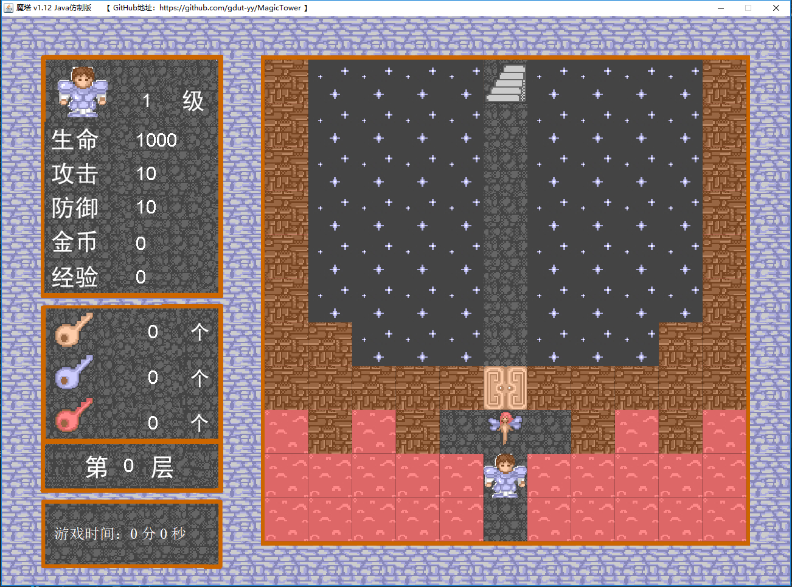

# MagicTower (仿制的 魔塔v1.12)

## 一、关于本项目

本人最早于 2006 年左右接触到魔塔游戏（魔塔 v1.12）。当时是刚学会上网不久，热衷于 4399网站上的小游戏。
一天晚上，因无聊，无意中打开了 4399小游戏里的[魔塔小游戏](http://www.4399.com/flash/1749.htm#search3)。
一瞬间感觉回到了童年。决心要以大学生的智慧通关。因尝试了多次也无法突破一些楼层，于是只好求助攻略，
不知不觉玩到了凌晨，终于通关。

因为对魔塔游戏的热爱，考虑到魔塔已经是十多年前的 flash 小游戏了（flash 已是过时技术），又因为是相关专业的学生，
于是便琢磨能不能把游戏重写一遍。于是，便有了本项目。

**注：**

- 项目下的[魔塔V1.12.swf](魔塔V1.12.swf)为原作品
- 项目下的为本人的仿制作品

## 二、操作指南（本游戏适合 18 岁以上用户）

- 方向键：人物移动
- 空格键：确认
- W S 键：商店、老人、商人、楼层跳跃事件的 
- J 键：获得 楼层跳跃 道具后，打开 楼层跳跃 面板
- L 键：获得 预测功能 道具后，打开 预测功能 面板

## 三、当前版本已知的 Bug（后续版本会修复）

1. 原魔塔有24层，当前仅实现了21层，（21层以上为隐藏楼层，需要时间输入数据）
2. 第二层的老人和商人的对话事件未实现
3. 楼层跳跃时可以跳跃到未到达过的楼层 
4. 相当一部分对话未完整，中英混合
5. ……